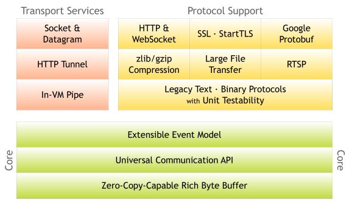
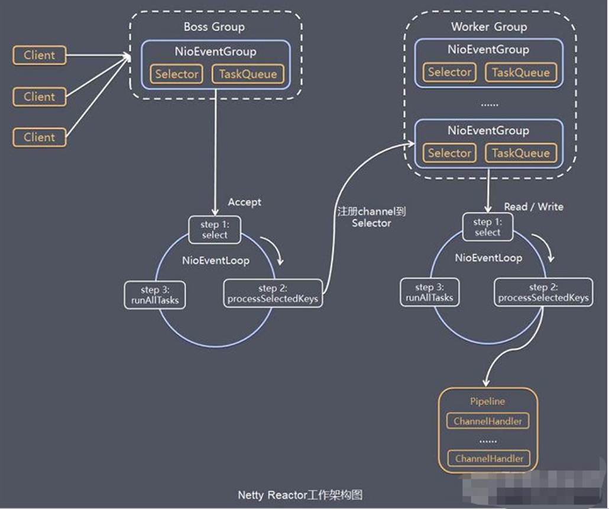

# Netty的简单使用
## Netty是什么
1. Netty是一个基于NIO的client-server框架, 使用Netty可以快速简单的开发网络应用程序
2. 它极大的简化和优化了TCP 和 UDP 套接字服务器等网络编程,并且性能以及安全性等很多方面更好
3. 支持多种协议 如 FTP，SMTP，HTTP 以及各种二进制和基于文本的传统协议。 
   
用官方的总结就是：Netty 成功地找到了⼀种在不妥协可维护性和性能的情况下实现易于开发，
   性能，稳定性和灵活性的⽅法。
* 用到Netty的框架 : Dubbo, RocketMQ, grpc, Elasticsearch
## Netty的优点
1. API使用简单，学习成本低。 
2. 功能强大，内置了多种解码编码器，支持多种协议, 自带编码器解码器, 解决TCP粘包/拆包问题
3. 性能高，对比其他主流的NIO框架，Netty的性能最优。性能高的原因 : 非阻塞IO, 零拷贝
4. 社区活跃，发现BUG会及时修复，迭代版本周期短，不断加入新的功能。 
5. Dubbo、Elasticsearch都采用了Netty，质量得到验证。
## Netty结构

## Netty工作模式
Netty中采用的是主从Reactor多线程模式, 因为单Reactor模式在高并发情况下Reactor会成为性能瓶颈, 因此让Reactor在多线程下运行

服务端 : 
1. 两组线程池 BossGroup专门负责接收客户端的连接, WorkGroup专门负责网络的读写, 它们的类型都是NioEventLoopGroup
2. NioEventLoopGroup 相当于 1 个事件循环组，这个组里包含多个事件循环 NioEventLoop，每个 NioEventLoop 包含 1 个 Selector 和 1 个事件循环线程
3. NioEventLoopGroup 有几个线程，可以在创建时来指定 默认为 cpu 核 * 2 
4. 每个 Boss NioEventLoop 循环执行的任务包含 3 步：
   1. 轮询 Accept 事件
   2. 处理 Accept I/O 事件，与 Client 建立连接，生成 NioSocketChannel，
      并将 NioSocketChannel 注册到某个 Worker NioEventLoop 的 Selector 上
   3. 处理任务队列中的任务，runAllTasks()
5. 每个 Worker NioEventLoop 循环执行的任务包含 3 步
   1. 轮询 Read、Write 事件；
   2. 处理 I/O 事件，即 Read、Write 事件，在 NioSocketChannel 可读、可写事件发生时进行处理；
   3. 处理任务队列中的任务，runAllTasks
   
## Netty常用组件
1. Channel ChannelHandler ChannelPipeLine ChannelFuture
   1. Channel是Netty中一个接口, 定义了网络通信和IO操作中最基础的一些方法
      * read, write, connect, bind方法
      * 常用Channel的实现类有NIOSocketChannel和NIOServerSocketChannel
   2. ChannelHandler是处理器接口, 处理IO操作, 网络连接等事件, 并会将事件转发给ChannelPipeLine中的下一个Handler
      一般会继承ChannelInboundHandlerAdapter或者SimpleChannelInboundHandler
   3. 每个ChannelHandler会自动分配给ChannelPipeLine, ChannelPipeLine是一个容器, 消息的处理会按照ChannelPipeLine中所定义
      的ChannelHandler的顺序进行处理
2. EventLoop NIOEventLoop EventLoopGroup
   * EventLoop是事件循环接口, 负责监听事件并调用事件处理器
   * EventLoopGroup中包含多个EventLoop
3. Bootstrap和ServerBootstrap

   bootstrap意思是引导，一个Netty应用通常由一个Bootstrap开始，主要作用是配置整个netty程序，串联各个组件。ServerBootstrap是服务端启动引导类，Bootstrap是客户端启动引导类
## Netty零拷贝
1. CompositeByteBuf 类, 将多个 ByteBuf 合并为逻辑上的一个 ByteBuf , 避免各个 ByteBuf 之间的拷贝
2. 通过 slice 操作, 因此可以将 ByteBuf 分解为多个共享同一个存储区域的ByteBuf, 避免了内存的拷⻉
3. 通过FileRegion包装的FileChannel.tranferTo实现文件传输, 可以直接将文件缓冲区的数据发送到目标Channel, 避免了传统通过循环 write 方式导致的内存拷⻉问题