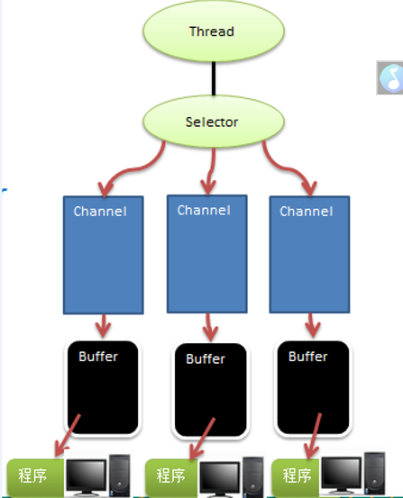
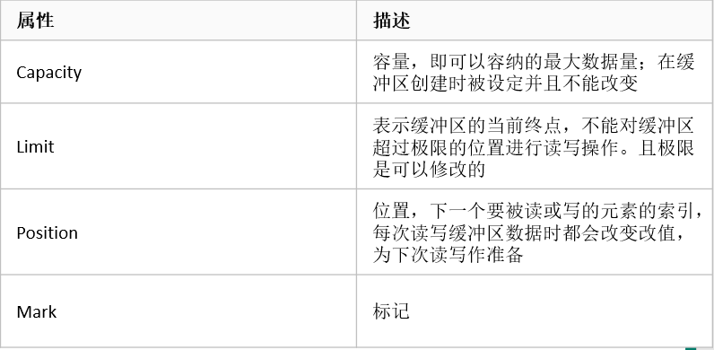
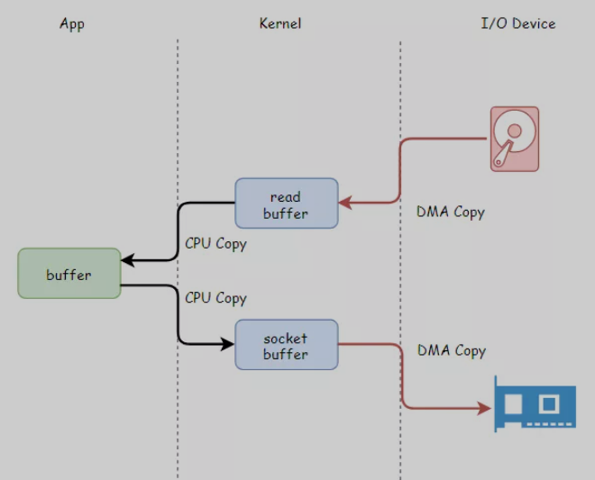
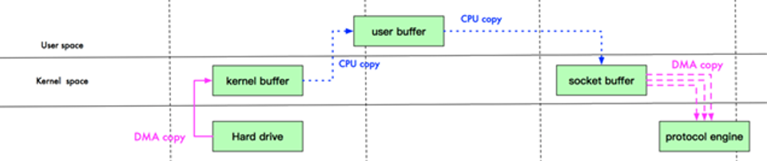
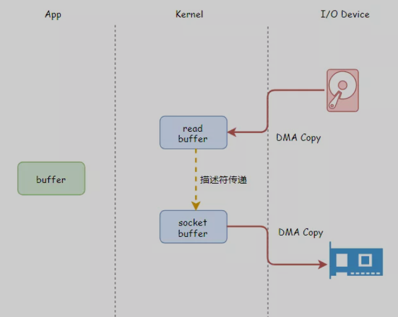

# NIO
## 三种IO模型
1. BIO
   * 仅适用于连接数较少的情况, 对服务器资源要求高
   * 同步阻塞, 一个连接一个线程, 如果连接不做任何事情会造成不必要的线程开销
   * 流程 : 
        1. 服务器端启动ServerSocket
        2. 客户端启动Socket连接服务端
        3. 客户端等待服务端响应
        4. 客户端线程等待请求结束后继续执行
   * 问题 :
        1. 每个请求创建独立的线程, 与对应的连接方进行数据Read, Write, 业务处理等
        2. 并发数较大时会创建大量的线程, 系统资源占用较大
        3. 建立连接后, 如果没有数据可读, 线程会阻塞在Read操作上, 造成资源浪费
2. NIO
   * 适用于连接数目比较多, 且连接短的情况
   * JDK1.4开始提供的, 是同步非阻塞的IO方式
   * 三大核心 : Channel, Buffer, Selector
     
     
3. AIO
   适用于连接数目多且连接较长的情况
## Buffer, Channel, Selector
1. Buffer
    * Buffer是一个父类, 根据写入数据的类型不同有很多子类, 如 ByteBuffer(最常用), CharBuffer, IntBuffer...
    * 四个关键属性
      
      
    * ByteBuffer
      
        ```
        ByteBuffer allocate(int capacity) //创建指定容量缓冲区。
        ByteBuffer allocateDirect(int capacity) //创建一个直接缓冲区，这样的ByteBuffer在参与IO操作时性能会更好, 免去了两次复制
        ByteBuffer wrap(byte [] array)
        ByteBuffer wrap(byte [] array, int offset, int length) //把一个byte数组或byte数组的一部分包装成ByteBuffer。
        //从buffer里读一个字节，并把postion移动一位  
        byte get(int index)
        //写模式下，往buffer里写一个字节，并把postion移动一位
        ByteBuffer put(byte b)
        int getInt()  //从ByteBuffer中读出一个int值。
        ByteBuffer putInt(int value)  // 写入一个int值到ByteBuffer中。
      
        Buffer clear()   //标记恢复到初始状态, 不清除数据, 后面写入数据会覆盖原来数据
        Buffer flip() 　 //把limit设为当前position，把position设为0，一般在从Buffer读出数据前调用。
        Buffer rewind()  //把position设为0，limit不变，一般在把数据重写入Buffer前调用。
        mark() & reset() //通过调用Buffer.mark()方法，可以标记Buffer中的一个特定position。之后可以通过调用Buffer.reset()方法恢复到这个position。
        ```
      
2. Channel
    * 与流的区别
        1. 通道是双向的, 读和写都可以进行
        2. 通道不能直接访问数据, 只能通过缓冲区
    * 常用的几种Channel实现
        1. FileChannel 用于文件的读写
        2. DatagramChannel 用于UDP的读写
        3. SocketChannel 用于TCP的读写, 多用于客户端中
        4. ServerSocketChannel 监听TCP连接请求, 每个请求会建立SocketChannel
    * FileChannel
        ```
        //1.创建一个RandomAccessFile（随机访问文件）对象，
        RandomAccessFile raf=new RandomAccessFile("D:\\niodata.txt", "rw");
        //通过RandomAccessFile对象的getChannel()方法。FileChannel是抽象类。
        FileChannel inChannel = raf.getChannel();
        //2.创建一个读数据缓冲区对象
        ByteBuffer buf = ByteBuffer.allocate(48);
        //3.从通道中读取数据
        int bytesRead = inChannel.read(buf);
        //创建一个写数据缓冲区对象
        ByteBuffer buf2 = ByteBuffer.allocate(48);
        //写入数据
        buf2.put("filechannel test".getBytes());
        buf2.flip();
        inChannel.write(buf);
        // 关闭通道
        channel.close();
        ```
    * SocketChannel和ServerSocketChannel
        ```
        //1.通过SocketChannel的open()方法创建一个SocketChannel对象
        SocketChannel socketChannel = SocketChannel.open();
        //2.连接到远程服务器（连接此通道的socket）
        socketChannel.connect(new InetSocketAddress("127.0.0.1", 3333));
        // 3.创建写数据缓存区对象
        ByteBuffer writeBuffer = ByteBuffer.allocate(128);
        writeBuffer.put("hello WebServer this is from WebClient".getBytes());
        writeBuffer.flip();
        socketChannel.write(writeBuffer);
        //创建读数据缓存区对象
        ByteBuffer readBuffer = ByteBuffer.allocate(128);
        socketChannel.read(readBuffer);
        StringBuilder stringBuffer = new StringBuilder();
        //4.将Buffer从写模式变为可读模式
        readBuffer.flip();
        while (readBuffer.hasRemaining()) {
            stringBuffer.append((char) readBuffer.get());
        }
        System.out.println("从服务端接收到的数据："+stringBuffer);
        socketChannel.close();
        ```
        ```
        try {
            //1.通过ServerSocketChannel 的open()方法创建一个ServerSocketChannel对象，open方法的作用：打开套接字通道
            ServerSocketChannel ssc = ServerSocketChannel.open();
            //2.通过ServerSocketChannel绑定ip地址和port(端口号)
            ssc.socket().bind(new InetSocketAddress("127.0.0.1", 3333));
            //通过ServerSocketChannelImpl的accept()方法创建一个SocketChannel对象用户从客户端读/写数据
            SocketChannel socketChannel = ssc.accept();
            //3.创建写数据的缓存区对象
            ByteBuffer writeBuffer = ByteBuffer.allocate(128);
            writeBuffer.put("hello WebClient this is from WebServer".getBytes());
            writeBuffer.flip();
            socketChannel.write(writeBuffer);
            //创建读数据的缓存区对象
            ByteBuffer readBuffer = ByteBuffer.allocate(128);
            //读取缓存区数据
            socketChannel.read(readBuffer);
            StringBuilder stringBuffer=new StringBuilder();
            //4.将Buffer从写模式变为可读模式
            readBuffer.flip();
            while (readBuffer.hasRemaining()) {
                stringBuffer.append((char) readBuffer.get());
            }
            System.out.println("从客户端接收到的数据："+stringBuffer);
            socketChannel.close();
            ssc.close();
        } catch (IOException e) {
            e.printStackTrace();
        }
        ```
      
3. Selector
    * Selector能够检测多个注册的Channel上是否有事件发生, 只有在通道真正有读写发生时才会进行读写, 避免了多线程之间切换上下文的开销
    * 工作流程 : Channel注册到Selector中, 调用Selector的方法将可进行IO操作的通道的SelectionKey加入到一个集合中, 对集合中每个对象进行处理
    * Selector 方法
        * public static Selector open() / Selector s = Selector.open() : 获取一个Selector对象
        * public int select(long timeout) : 监控所有注册的Channel, 其中有IO操作可以进行时, 将对应的SelectionKey加入内部集合中, timeout为超时时间
        * public Set<SelectionKey> selectedKeys() : 获取集合中所有SelectionKey对象
    * SelectionKey : Selector和Channel的注册关系
        * int OP_ACCEPT 接受
        * int OP_CONNECT 连接
        * int OP_READ 读
        * int OP_WRITE 写
        * 还有几个方法, 无非就是 selector(), channel(), isReadable()....作用一目了然
    * 注册Channel
        ```
        channel.configureBlocking(false);
        //通道必须是非阻塞类型
        SelectionKey key = channel.register(selector, Selectionkey.OP_READ); //可以用'|'添加多个监听类型
        ```
    ```
    public static void main(String[] args) {
        try {
            ServerSocketChannel s = ServerSocketChannel.open();
            s.socket().bind(new InetSocketAddress("127.0.0.1", 8888));
            s.configureBlocking(false);
            Selector selector = Selector.open();
            s.register(selector, SelectionKey.OP_ACCEPT);

            ByteBuffer readBuff = ByteBuffer.allocate(1024);
            ByteBuffer writeBuff = ByteBuffer.allocate(128);
            writeBuff.put("服务端:)".getBytes());
            writeBuff.flip();
            while (true) {
                int nReady = selector.select();
                Set<SelectionKey> keys = selector.selectedKeys();
                Iterator<SelectionKey> it = keys.iterator();
                while (it.hasNext()) {
                    SelectionKey key = it.next();
                    it.remove();
                    if (key.isAcceptable()) {
                        SocketChannel socketChannel = s.accept();
                        socketChannel.configureBlocking(false);
                        socketChannel.register(selector, SelectionKey.OP_READ | SelectionKey.OP_WRITE);
                    }
                    else if (key.isReadable()) {
                        SocketChannel socketChannel = (SocketChannel) key.channel();
                        readBuff.clear();
                        socketChannel.read(readBuff);
                        readBuff.flip();
                        System.out.println(new String(readBuff.array()));
                        key.interestOps(SelectionKey.OP_WRITE);
                    }
                    else if (key.isWritable()) {
                        writeBuff.rewind();
                        SocketChannel socketChannel = (SocketChannel) key.channel();
                        socketChannel.write(writeBuff);
                        key.interestOps(SelectionKey.OP_READ);
                    }
                }
            }
        } catch (IOException e) {
            e.printStackTrace();
        }
    }
    ```
    ```
    public static void main(String[] args) {
        try {
            SocketChannel socketChannel = SocketChannel.open();
            socketChannel.connect(new InetSocketAddress("127.0.0.1", 8888));

            ByteBuffer writeBuffer = ByteBuffer.allocate(32);
            ByteBuffer readBuffer = ByteBuffer.allocate(32);

            writeBuffer.put("客户端:)".getBytes());
            writeBuffer.flip();

            while (true) {
                writeBuffer.rewind();
                socketChannel.write(writeBuffer);
                readBuffer.clear();
                socketChannel.read(readBuffer);
                System.out.println(new String(readBuffer.array()));
                readBuffer.clear();
                TimeUnit.SECONDS.sleep(3);
            }
        } catch (IOException | InterruptedException e) {
            e.printStackTrace();
        }
    }
    ```
## 零拷贝
1. 什么是零拷贝
   * 零拷贝技术可以减少数据拷贝和共享总线操作的次数，
     消除传输数据在存储器之间不必要的中间拷贝次数，
     从而有效地提高数据传输效率。
     而且，零拷贝技术减少了用户应用程序地址空间和操作系统内核地址空间之间因为上下文切换而带来的开销。
     进行大量的数据拷贝操作其实是一件简单的任务，
     从操作系统的角度来说，如果 CPU 一直被占用着去执行这项简单的任务，那么这将会是很浪费资源的；
     如果有其他比较简单的系统部件可以代劳这件事情，从而使得 CPU 解脱出来可以做别的事情，
     那么系统资源的利用则会更加有效。
   * 原来的情况
      
      
      1. 程序使用read()发生一次从用户态到内核态的切换, 在内核态中完成数据的读取, 存储在内核态缓冲区中
      2. 数据被copy到user buffer中，切换到用户态中。
      3. 调用send()函数, 切换到内核态, 并且把数据copy到内核态的缓冲区
      4. 数据拷贝到protocol engine, send()返回结果, 切换到用户态
         
      
   * 零拷贝的情况
     
      
      
      减少了用户态和内核态之间的切换次数, 同时避免了将数据从内核态缓冲区中拷贝到用户区中 
2. NIO实现零拷贝
NIO中使用transferTO和transferFrom方法, 将一个Channel中的数据拷贝到另一个Channel,
   不需要将源数据从内核态拷贝到用户态，再从用户态拷贝到目标通道的内核态，
   同时也减少了两次用户态和内核态间的上下文切换，即“零拷贝”.
   
事实上, transferTo和transferFrom回调用linux的sendfile方法, 对于网卡支持 SG-DMA 的情况能够实现零拷贝, 将数据以DMA的方式从磁盘读到内核空间的缓冲区
, 然后将内核缓冲区的描述符和数据长度传给socket缓冲区, 网卡能够直接将内核缓冲区的数据拷贝到自己的缓冲区
如果网卡不支持还是会先传到socket缓冲区再传到网卡缓冲区

3. 关于内核缓冲区 PageCache
之所以有这个内核缓冲区, 是因为系统认为最近访问的数据是较为频繁被访问的数据, 为了减少读取磁盘的时间, 利用这块高速缓存存放最近读取的磁盘数据
也因此而多一次拷贝, 对于大文件采用这种方式IO是不合适的, 因为会占据较大的pageCache, 导致较多的热点小文件数据不能放在pageCache中, 因此传输大文件
一般采用 异步IO+直接IO的方式, 即调用read命令后不再拷贝至内核缓冲区, 采用异步的方式, 系统发起IO请求后就返回, 等到磁盘准备好数据会直接拷贝
到用户缓冲区完成后, 通知用户进程处理数据
在nginx中可以配置使用sendfile的同时配置文件大小作为使用直接IO+异步IO的阙值